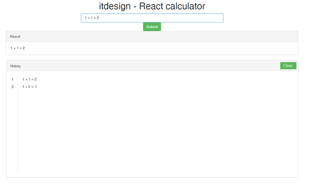

# Inline Calculator

## Introduction

This application uses the JavaScript framework React. It contains a skeleton of a front-end calculator app for inline calculation. Your job is to complete implementation of the React Components and a few functions responsible for calculator logic. Furthermore you have to implement a second component to store and display a history of the executed calculations.

## Task Details
There are two React.Component classes stored in the components folder. These classes are responsible for rendering logic. There also is a Calculation class stored in the logic folder. This class is responsible for calculation logic. The main function of the application is the calculation of the expression entered in the corresponding `<input>` field followed by rendering the result in the HTML element below.

1. **Implement the Calculation class**
The Calculation.calculate() method should evaluate and calculate entered input and return the result. If the given expression is wrong or malformed return false. The expected input is not limited to one operator. The minimum required set of functions is `+, -, *, /`. These are covered by unit tests. Feel free to extend this set of functions on your own.

2. **Complete the Layout React Component**
It should render the output label of the app according to expression received from the `<input>` field.
If the given expression is wrong or malformed return the 'Wrong input!' statement.
If the expression is correct it should be displayed with arguments and result separated by a space character. For example, the input *1.28+2.89*  should be rendered as *1.28 + 2.89 = 4.17*

3. **Implement the History React Component**
Extend the application by adding a History component that displays the already calculated equations. The results should be ordered with the newset entry as first element. Additionally it should be possible to clear the entire history using a clear button. The following mock represents the expected result: 

### Hints

- Form follows function
- You shouldn't modify code outside the mentioned classes, just complete the specified *TODO* statements to make the tests run as expected. Do not use `eval()`.
- You will find some unit tests within the 'test' folder. They may be helpful to implement the solution. To execute all the tests, use following commands: `npm install && npm test`
- Document and test functionality added by yourself.
